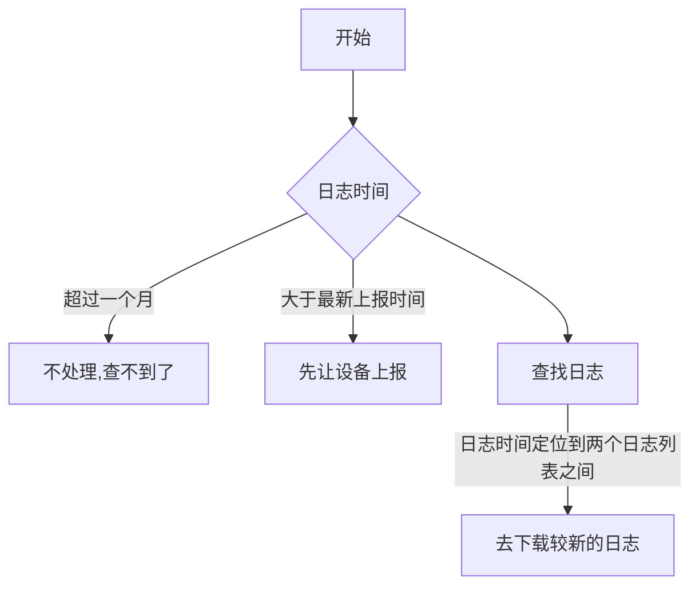

### 目标：通过账号和时间从中控快速下载终端日志

原因：目前通过中控日志的方式比较繁琐 


#### 1.OA登录(获取cookies)

进度： 完成

#### 2.通过账号获取门店信息

进度：成功获取

#### 3.模糊查询店铺信息(门店名查询门店ID)

```json
{ BCID: [ '14' ],
  Address: '静安区吴江路169号四季坊1楼149商铺',
  Img_Do: 0,
  ShowBook: 0,
  MBgImage: '',
  TBgImage: '',
  AvgPrice: 37,
  alipay_shop_name: '',
  good_service_status: 0,
  OrderDistanceLimit: 3000,
  VoucherValue: 0,
  alipay_shop_id: '0',
  EnterInRate: 1,
  mmvalue: '',
  park_info: '',
  search_update_time: 1534150433,
  AvgReview: 45,
  koubei_category: '',
  Longitude: '121.460242',
  GoodUpdateTime: '2015-06-26 10:21:38',
  DisFlag: 1,
  ShopType: 1,
  book_total: 0,
  app_pay: 1,
  EnPrint: 0,
  value: 47113,
  Description: '美味体验店',
  shareFlag: 0,
  Traffic: '',
  callcenter_flag: 0,
  BookVersion: '',
  maxWaitLimit: 10800,
  OrderPrintNum: 2,
  queue_service_status: 0,
  offInvalid: 0,
  StyleCooking: '美食',
  CityAreaID: [ '409' ],
  subCommission: 0,
  QueueVersion: '2017-03-13 11:02:01',
  ShopHours: '12:00-22:00',
  shop_total: 0,
  address: '静安区吴江路169号四季坊1楼149商铺',
  ShopQueueLimit: 30000,
  LegalPerson: '美味不用等',
  book_quick_total: 0,
  Services:
   [ '1',
     '2',
     '4',
     '5',
     '6',
     '7',
     '8',
     '9',
     '10',
     '12',
     '13',
     '14',
     '17',
     '18',
     '19',
     '20',
     '21',
     '22',
     '23',
     '24' ],
  Type: 2,
  queue_service_last_time: 1536947760,
  VoucherLimitation: 5000000,
  LastTime: '2018-08-28 02:00:02',
  label: '美味体验店(张普店)',
  Email: '',
  bk_optional_seat: 0,
  Latitude: '31.229506',
  Index: 0,
  LngGPS: '',
  book_order_handle_type: 0,
  CreateDate: '2015-06-05 17:48:39',
  Industry: 1,
  CheckWay: 1,
  ConsumptionRatio: 1,
  OnLine: 1,
  QueueState: 0,
  TiyanDian: 1,
  Cooperation: 1,
  LatGPS: '',
  TableCount: 0,
  mall_name: '',
  tag: [ '13' ],
  Encryptedvalue: '40182bb49d3ffd205c2f2d3b41b8ac3421be39f5',
  bk_box: 0,
  Sent: 0,
  BgImage:
   'http://img1.9now.cn/Files/201512/2316/1450859373524.jpg?ID=1577860',
  MemFunc: 1,
  WaitList: 0,
  Definevalue: '',
  City: 239,
  BookPhone: '',
  QueuingTotal: 0,
  State: 3,
  linQu: '',
  NamePinyin: 'meiweitiyandian(zhangpudian)',
  RegImage: '',
  clientManager: '张普',
  PayPrintNum: 2,
  rail_transit_info: '',
  EntityStore: 1,
  c_services: [ '' ],
  koubei_services: [ '' ],
  Shoppingmallvalue: 13947,
  service_quick: 0,
  IntegralRatio: '1.0',
  countryId: 1,
  alipay_koubei: 0,
  koubei_avg_popularity: 0,
  KuaiCanMode: 0,
  open_tag: [ '' ],
  book_service_status: 1,
  TLogo:
   'http://img1.9now.cn/Files/201512/2316/1450859373619.jpg?ID=1577861',
  RegNum: '美味不用等',
  smart_shop_style: 0,
  quick_total: 0,
  Managevalue: 43,
  AreaID: 18,
  orderCount: 0,
  Logo:
   'http://img1.9now.cn/Files/201512/2316/1450859373401.jpg?ID=1577859',
  DianpingID: 0,
  ProvinceID: 22,
  Integrals: 0,
  group_id: 0,
  RegName: '美味不用等',
  idleOrderCount: 0,
  MLogo:
   'http://img1.9now.cn/Files/201512/2316/1450859373524.jpg?ID=1577860',
  attenActive: '',
  Tel: '021-12345678',
  location: '31.229506,121.460242',
  forever: 1,
  second_show_book: 0,
  koubei_per_pay: 0 }


```


进度：完成

####4. 门店ID获取账号列表

进度：完成

#### 5. 通过账号通知设备上报日志

进度：完成

#### 6. 门店名获取日志列表

```javascript
{
id: "1229812",
deviceId: "HZ505LBA0I381IU",
account: "mwtydzpdwp2",
shopName: "美味体验店(张普店)",
upTime: "2018-08-18 07:08:32",
appVersion: "2.9.4-debug",
deviceVersion: "24",
deviceModel: "T1",
logUrl: "-"
}
```


进度：完成

#### 7.下载对应时间对应账号日志zip文件

日志位置判断：

进度： 完成

#### 8.解压文件并打开对应时间日志

进度：解压完成打开对应时间日志未完成.


#### 问题整理

1. cheerio(jquery) 学习使用不熟悉。[jquery api](http://www.w3school.com.cn/jquery/traversing_eq.asp)


